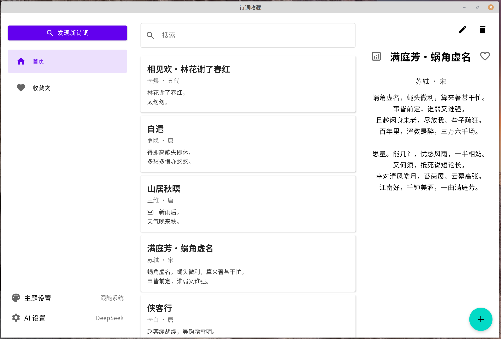
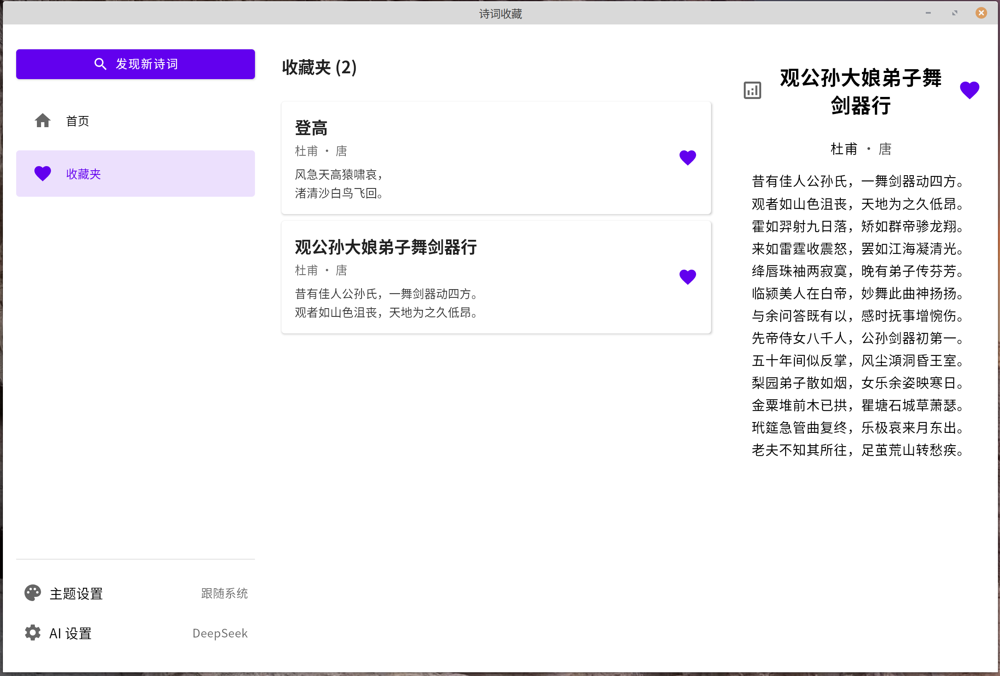
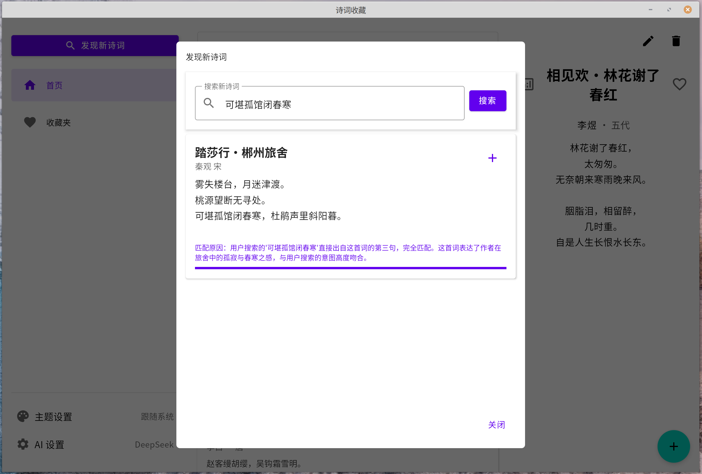

# PoemKMP - AI 智能诗词收藏应用

一个跨平台桌面应用，用于发现、收藏和鉴赏古典诗词，融合人工智能技术。


## ✨ 功能特性

- **智能诗词发现**：基于DeepSeek、Gemini AI 根据描述推荐相关诗词
- **综合收藏管理**：创建、编辑、删除和管理个人诗词库
- **AI 智能赏析**：利用人工智能生成诗词解析与鉴赏
- **高级搜索**：快速定位系统中的诗词作品
- **收藏夹系统**：便捷管理您最喜爱的诗词
- **跨平台支持**：原生支持 Windows、MacOS 和 Linux
- **主题切换**：支持系统主题/浅色模式/深色模式

## 🖼 示例图片







## 🚀 快速开始

### 环境要求

- Java 运行环境（JRE）17 或更高版本（开发要求，普通使用则不用）
- DeepSeek API 或 Google Gemini API 密钥（用于 AI 功能）

### 安装步骤

下载适用于你的操作系统的安装包。

[📦 Windows 下载]() | [🐧 Linux 下载]() | [🍏 MacOS 下载]()

- Windows：`.msi` 或 `.exe` 安装程序
- macOS：`.dmg` 镜像文件
- Linux：`.AppImage` 或 `.rpm` 包

安装后运行 PoemKMP，开始探索诗词的世界！

** 诗词数据库db文件在当前用户家目录下的`.poemkmp`文件夹中。 **

### 配置指南

1. 启动应用程序
2. 进入左侧边栏的 AI 设置
3. 输入您的 DeepSeek API 密钥
4. 开始探索和收藏诗词！

## 🛠️ 技术栈

- **界面框架**：Jetbrains Compose Multiplatform
- **数据库**：SQLDelight
- **网络请求**：Ktor 客户端
- **配置管理**：Multiplatform Settings
- **序列化**：Kotlinx Serialization
- **AI 集成**：DeepSeek API / Google Gemini API

## 🗂️ 项目结构

```
.
├── src/
│   ├── commonMain/          # 共享代码
│   │   ├── kotlin/         # Kotlin 源代码
│   │   └── sqldelight/     # 数据库架构
│   └── desktopMain/        # 桌面端特定代码
├── build.gradle.kts        # 构建配置
└── README.md
```

## 🤝 参与贡献

欢迎贡献！欢迎提交 issue 和 pull request。

## 📝 开源协议

本项目采用 Apache 2.0 许可证，详见 LICENSE 文件。

## 📧 联系我

如需支持或咨询，请联系：puraz2258@gmail.com